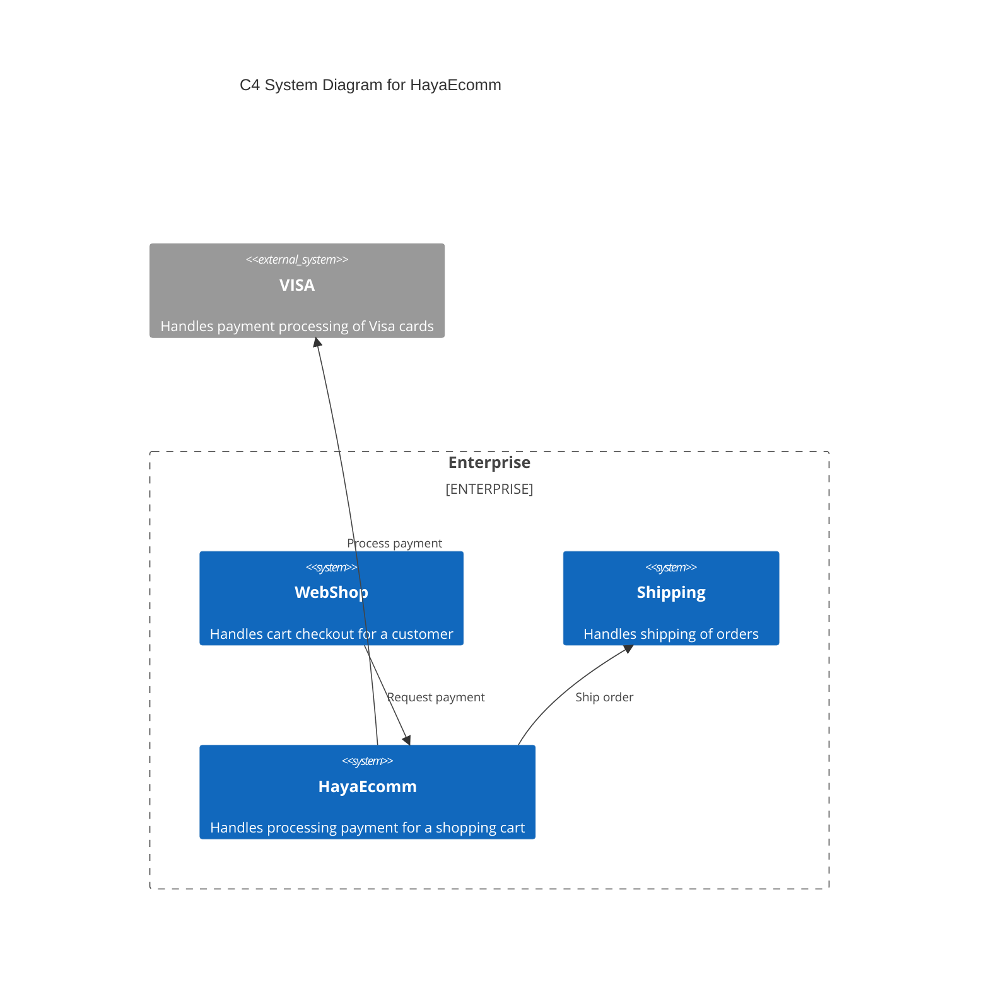

# CRC

This document describes the components, responsibilities, and collaborators for a codebase.

## Responsibilities

|Responsibility|Component|
|---|---|
|Handles order processing|[CreditCardPaymentUsecase](/Users/devon.burriss/Documents/GitHub/haya-net/examples/Example/HayaEcomm.cs)|

## Collaborators

|Collaborator|Component|Description|
|---|---|---|
|Checkout|[PaymentsController](/Users/devon.burriss/Documents/GitHub/haya-net/examples/Example/HayaEcomm.cs)|Handles cart checkout for a customer|
|Visa Payment Provider|[VisaPaymentService](/Users/devon.burriss/Documents/GitHub/haya-net/examples/Example/HayaEcomm.cs)|Handles payment processing of Visa cards|
|Shipping Service|[ShippingService](/Users/devon.burriss/Documents/GitHub/haya-net/examples/Example/HayaEcomm.cs)|Handles shipping of orders|

